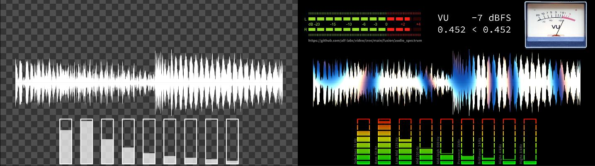
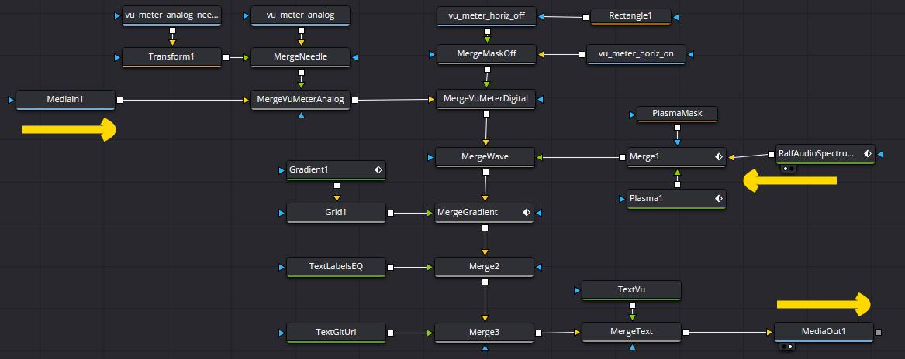

# Audio Waveform and Spectrum Fuse

## Overview

This DaVinci Fusion plugin renders a WAV as a waveform, and/or as an EQ bar spectrum.

Here’s the demo of what it can achieve:
https://youtu.be/auhcC5L7DoA

or click the image below to watch the YT video:

The rest of this document focuses on usage explanations, and implementation details.

## Instalation

To install, grab the Fuse file here:  [`RalfAudioSpectrum.fuse`](RalfAudioSpectrum.fuse)

and copy it in
`%APPDATA%\Blackmagic Design\DaVinci Resolve\Support\Fusion\Fuses\`
a.k.a.
`C:\Users\%USERNAME%\AppData\Roaming\Blackmagic Design\DaVinci Resolve\Support\Fusion\Fuses\`
then restart DaVinci Resolve.

## Implementation

I have some notes on the implementation on my blog here:

https://www.alfray.com/ralf/blog/dev/2026-06-07_audio_waveform_and_spectrum__de1a556a.html

## Usage Guide

The image output of the plugin corresponds to the image on the left here:

The output is purposely just white, because I’m going to then compose it or mask it with other effect layers,
as can be seen on the image on the right above.

To do this, I also use the exported variables, for example to animate the VU Meter dials.
Here’s the node graph that produced the image on the right above:

Usage overview:

  * Use the first tab to select the WAV file to render.
    This should be either a mono or stereo uncompressed WAV, in 16-bit Little-Endian format.
  * Second tab controls the amplitude detection for the VU Meter.
    Select the number of seconds of music to scan for instant volume loudness
    as well as the smoothing factor.
  * The wavevorm display is optional. When displayed, the options are full wave,
    half wave. The height can be modulated using the instant volume loudness.
    Fill vs stroke opacities can be selected (color is always white).
  * The EQ display is also optional. Control is only on the width of the bars,
    stroke, and opacity.

The VU Meter instant loudness is computed using an RMS on a sliding window.

The EQ bands are fixed to represent 9 octaves:
31.25 Hz, 62.50 Hz, 125 Hz, 250 Hz, 500 Hz, 1 kHz, 2 kHz, 4 kHz, 8 kHz.
These are computed using a digital biquad filter.

The fuse exports the following parameters:

  * `Output`: The generated image.
  * `VuMeterDb`: The dBFS value of the VU Meter.
  * `VuMeterLinear`: The raw value of the instant loudness, before dBFS log conversion.
  * `VuMeterLinearMin`: The recent minimum value of `VuMeterLinear`.
  * `VuMeterLinearMax`: The recent maximum value of `VuMeterLinear`.
    This allows a formula to convert the VuMeter linear value into a percentage
    rather than an absolute value
  * `EqBand1` up to `EqBand9`: The value of the biqual filter for each band.

(TODO expand and add some parameter panel screenshots)

This plugin makes no attempt to fully customize the visual output.
It is expected that other nodes in the Fusion graph will use the exported parameters
to adjust rendering (opacity, position, size, colors, etc.) as needed.

~~

